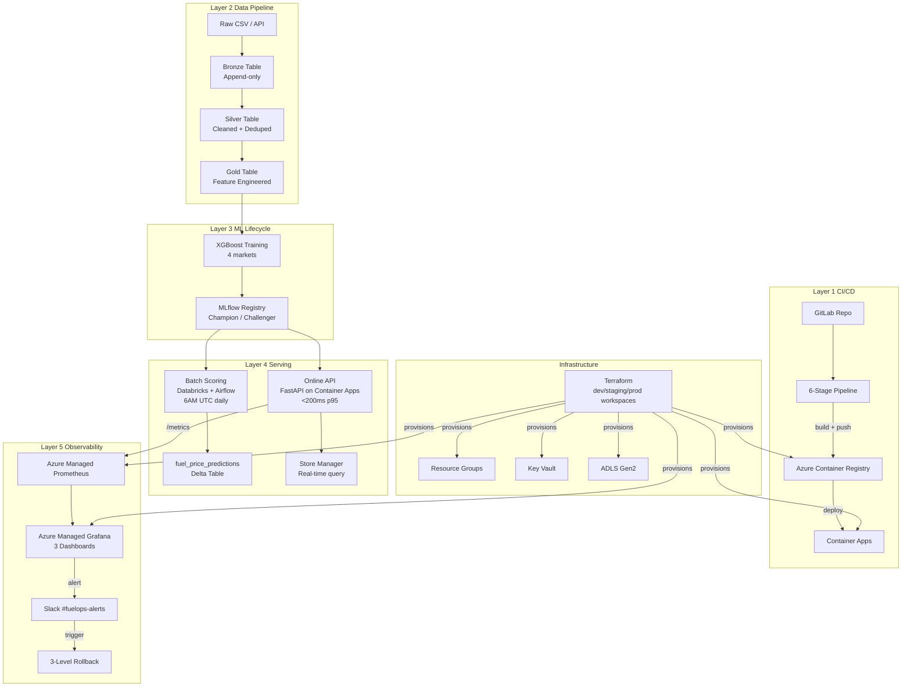

# FuelOps MLOps Platform

Production-grade MLOps platform for fuel price prediction across 4 US markets (EST/CST/MST/PST).
Built for 7-Eleven.

## Overview

| Property | Value |
|---|---|
| Dataset | 540,000 rows  2000 stores  4 markets  3 fuel types  90 days |
| Models | XGBoost per market (EST/CST/MST/PST)  champion/challenger pattern |
| Serving | Batch (Databricks + Airflow) + Online (FastAPI on Azure Container Apps) |
| Environments | dev / staging / prod via Terraform workspaces |
| CI/CD | GitLab 6-stage pipeline with manual production gate |

---

## Architecture

### System Layers
```

  Layer 1  Source & CI/CD                                       
  GitLab Repo  6-stage pipeline  ACR  Container Apps         

  Layer 2  Data Pipeline                                        
  ADLS Gen2: Bronze  Silver  Gold (Delta Lake, ACID)           

  Layer 3  ML Lifecycle                                         
  XGBoost training  MLflow registry  Champion/Challenger       

  Layer 4  Serving                                              
  Batch: Databricks + Airflow (6AM UTC daily, 6000 predictions)  
  Online: FastAPI on Container Apps (<200ms p95)                 

  Layer 5  Observability                                        
  Azure Managed Prometheus  Azure Managed Grafana  Slack       

```

### Architecture Diagram (Mermaid)


---

## Repository Structure
```
fuelops-mlops/
 terraform/
    main.tf                    # Provider config, core resources
    monitoring.tf              # Azure Managed Prometheus + Grafana
    variables.tf               # Input variables
    outputs.tf                 # Output values
    environments/
       dev.tfvars
       staging.tfvars
    modules/
        storage/               # Reusable ADLS Gen2 module
 src/
    inference/
       main.py                # FastAPI app v2.1.0
       requirements.txt
    monitoring/
        drift_detection.py     # PSI drift detection
 docker/
    Dockerfile                 # Non-root, python:3.11-slim
 airflow/
    dags/
        fuelops_pipeline.py    # 13-task DAG
 monitoring/
    prometheus/
       prometheus.yml
    grafana/
        dashboards/
        provisioning/
 scripts/
    rollback/
        api_rollback.sh        # Container Apps revision activate
        model_rollback.py      # MLflow alias swap
        data_rollback.sql      # Delta RESTORE TABLE
        README.md
 tests/
    unit/
       test_api.py            # 7 tests
    integration/
        test_integration.py    # 5 tests
 notebooks/                     # Phase 1 Databricks notebooks
 docs/
    incident_report_2026-03-23.md
    drift_report_2026-03-23.json
    chaos_test_log_2026-04-07.md
 .gitlab-ci.yml                 # 6-stage CI/CD pipeline
```

---

## CI/CD Pipeline

Six stages. Stages 1-2 run on every push. Stages 3-6 run on merge to main only.
```
Stage 1: lint           flake8 + black --check
Stage 2: test           pytest 7 unit tests + coverage
Stage 3: integration    schema + endpoint validation
Stage 4: build          docker build + push to ACR (commit SHA tag)
Stage 5: deploy-staging  az containerapp update (automatic)
Stage 6: deploy-prod    az containerapp update (MANUAL GATE)
```

**Authentication:** Service Principal stored as GitLab CI/CD variables.
Never stored in code. Rotated regularly.

---

## Inference API

| Property | Value |
|---|---|
| Framework | FastAPI + Uvicorn |
| Hosting | Azure Container Apps (auto-scale 0-3 replicas) |
| Latency | <200ms p95 (mock model), <500ms p95 (under load) |
| Auth | X-API-Key header via Azure Key Vault |
| Version | 2.1.0 |

**Endpoints:**
```
POST /predict   { cost, competitor_price, volume, market, fuel_type, store_id }
                { predicted_price, confidence_interval, model_version }
GET  /health    { status, model_version, model_type, uptime_check }
GET  /metrics   Prometheus format
GET  /version   { service, version, build, markets, endpoints }
```

---

## Rollback Procedures

Three levels  all scripted and tested (Day 18 + Day 23):

| Level | Trigger | Command | Time |
|---|---|---|---|
| API | Bad container image | `az containerapp revision activate --revision <prev>` | <2 min |
| Model | RMSE degradation | `python scripts/rollback/model_rollback.py` | <1 min |
| Data | Corrupted Delta table | `RESTORE TABLE silver_fuel_prices TO VERSION AS OF <n>` | <5 min |

---

## Monitoring

**Metrics collected (Azure Managed Prometheus):**
- `request_latency_seconds`  Histogram, labelled by endpoint
- `prediction_count_total`  Counter, labelled by market + fuel_type
- `error_count_total`  Counter, labelled by error type
- `model_info`  Info, current model version

**Alert thresholds:**
| Metric | Warning | Critical |
|---|---|---|
| p95 latency | >200ms | >500ms |
| Error rate | >1% | >5% |
| RMSE per market | >10% baseline | >50% baseline |
| Feature drift PSI | >0.1 | >0.2 |

**Grafana dashboards:**
1. FuelOps MLOps Platform  API Health (10 panels)
2. FuelOps MLOps Platform (Azure Monitor)  Container App metrics

---

## Airflow Pipeline

13-task DAG. Runs daily at 6AM UTC.
```
pipeline_start
   ingest_raw_data
   process_bronze (Databricks job)
   data_quality_check
   process_silver
   process_gold
   train_models
   evaluate_models
   check_drift (PSI detection)
   notify_slack
   await_approval (ManualApprovalSensor)
   score_predictions
   pipeline_end
```

Human approval required before scoring. Slack notification includes drift scores.

---

## Multi-Environment Setup

| Resource | Dev | Staging |
|---|---|---|
| Resource Group | rg-fuelops-dev | rg-fuelops-staging |
| Storage | fuelopsdatadev | fuelopsdatastaging |
| Key Vault | kv-fuelops-dev | kv-fuelops-staging |
| ACR | fuelopsacrdev | fuelopsacrstaging |
| Container App | fuelops-api-dev | not provisioned |
| Grafana | grafana-fuelops-dev | grafana-fuelops-staging |
| Prometheus | amw-fuelops-dev | amw-fuelops-staging |

Deploy to staging: automatic on merge to main
Deploy to prod: manual gate in GitLab pipeline

---

## Chaos Testing Results (Day 23)

Five failure scenarios tested and documented:

| Scenario | Finding | Recovery |
|---|---|---|
| Corrupt Bronze data | NULL cost silently dropped; invalid market leaks to Silver | DELETE + pipeline re-run |
| Deploy bad model | Azure Grafana detects traffic anomaly | Revision rollback <2 min |
| API overload (100 req) | 100% success rate; avg 3491ms under load | Auto-scale, no action |
| Wrong SP credentials | Deploy-staging fails; build masked by runner cache | Restore GitLab variable |
| Missing Key Vault secret | No live impact; secret baked into container at deploy | az keyvault secret recover |

---

## Azure Resources

| Resource | Name | Purpose |
|---|---|---|
| Resource Group | rg-fuelops-dev | All dev resources |
| Storage Account | fuelopsdatadev | Bronze/Silver/Gold Delta tables |
| Key Vault | kv-fuelops-dev | Secrets management |
| Container Registry | fuelopsacrdev | Docker image storage |
| Container App Env | cae-fuelops-dev | Container Apps environment |
| Container App | fuelops-api-dev | FastAPI inference API |
| Log Analytics | log-fuelops-dev | Centralized logging |
| Managed Prometheus | amw-fuelops-dev | Metrics collection |
| Managed Grafana | grafana-fuelops-dev | Dashboards + alerts |

All provisioned via Terraform. Destroy daily to manage costs.

---

## Local Development
```bash
# Start monitoring stack
docker-compose up -d

# Services:
# Airflow UI:   http://localhost:8080 (admin/admin)
# Prometheus:   http://localhost:9090
# Grafana:      http://localhost:3000 (admin/admin)
# FastAPI:      http://localhost:8000

# Run tests
pip install -r src/inference/requirements.txt
pytest tests/unit/ -v --cov=src

# Terraform (dev)
cd terraform
terraform workspace select dev
terraform apply -var-file="environments/dev.tfvars"

# Daily cleanup
terraform destroy -var-file="environments/dev.tfvars"
az keyvault purge --name kv-fuelops-dev --location eastus
```

---

## Phase 1 (Complete)

25 Databricks notebooks across 5 modules:
- Module 1: Data Foundation  Bronze/Silver/Gold pipeline
- Module 2: Model Lifecycle  MLflow training + registry
- Module 3: CI/CD & Automation  Databricks Workflows + Asset Bundles
- Module 4: Monitoring & Ops  Drift detection + rollback
- Module 5: Integration & Demo  End-to-end run

---

*Built by Parthipan S | MLOps Engineer  | April 2026*
